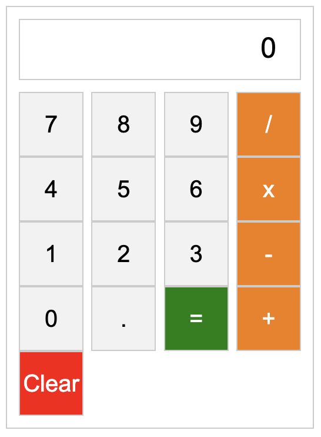

# calculator

This is a simple calculator web application built with HTML, CSS, and JavaScript.

## Preview

## Demo

You can view a live demo of the project [here](https://anthonynguyent.github.io/calculator/).

## Technologies Used
- HTML5
- CSS3
- Javascript (ES6)
- Visual Studio Code

## Features

- Perform basic arithmetic operations: addition, subtraction, multiplication, and division.
- Clear the display to start a new calculation.
- Evaluate the result with the equal (=) button.
- Responsive design for different screen sizes.

## How to Use

1. Clone this repository to your local machine.
2. Open the `index.html` file in your web browser.

## How It Works

The calculator supports the following operations:

- Addition: `+`
- Subtraction: `-`
- Multiplication: `x`
- Division: `/`

Simply click the number buttons to enter the digits of the calculation. Press an operator button to select the desired operation. Click the equal (=) button to evaluate the expression and display the result.

## Example

Suppose you want to calculate `(5 + 3) * 2`. Here's how you would enter it into the calculator:

1. Click the number button `5`.
2. Click the addition operator button `+`.
3. Click the number button `3`.
4. Click the multiplication operator button `x`.
5. Click the number button `2`.
6. Click the equal button `=`.

The calculator will show the result `16`.

## License

This project is licensed under the [MIT License](LICENSE).